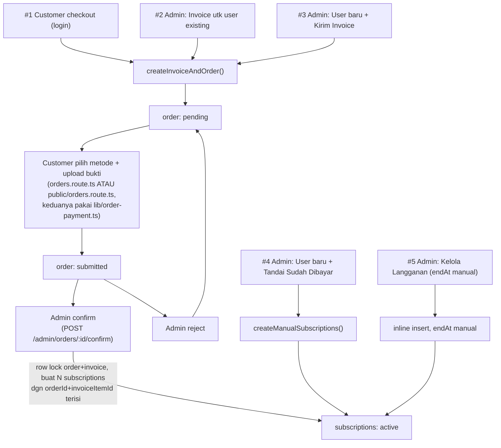

# Architecture — Alur Transaksi (Invoice → Payment → Subscription)

> Dokumen KHUSUS untuk memetakan ALUR TRANSAKSI end-to-end (bukan skema
> tabel per-domain, itu sudah ada di `architecture-invoice.md`/
> `architecture-payment.md`/`architecture-subscription.md`) — supaya ada
> SATU peta yang jelas: dari mana saja transaksi bisa MULAI, "mesin"
> (fungsi shared) mana yang dipakai tiap titik, dan bagaimana semuanya
> berujung ke `subscriptions` aktif. Ditulis 2026-09-05 diminta user,
> supaya gampang dikembangkan — SEMUA isi diverifikasi langsung ke kode
> yang berjalan, bukan disalin dari ingatan/asumsi.

## Kenapa Dokumen Ini Perlu Ada

3 dokumen existing (`architecture-invoice.md`, `architecture-payment.md`,
`architecture-subscription.md`) masing-masing benar dari sudut pandang
DOMAIN-nya sendiri, tapi TIDAK ADA yang memetakan ALUR PENUH lintas
domain: siapa yang bisa memicu pembuatan invoice, jalur mana yang
BYPASS invoice sama sekali, dan fungsi mana yang WAJIB dipakai ulang
kalau nanti dikembangkan (mis. checkout publik di landing page — lihat
§ terakhir dokumen ini). Tanpa peta ini, resiko nyata: developer
berikutnya (termasuk Claude sesi lain) menulis ULANG logic yang
sebenarnya sudah ada, di endpoint baru yang mestinya tinggal panggil
fungsi shared yang sudah ada.

## 3 Entitas Inti & Status-nya

```
invoices.status:      unpaid → paid            (juga: void, expired — LIHAT § Known Gaps, belum ada mekanisme otomatis ke expired)
orders.status:        pending → submitted → paid
                                ↘ rejected ↗   (resubmit balik ke submitted)
subscriptions.status: pending_payment → active → expired
```

- **1 invoice bisa punya BANYAK `invoiceItems`** (1 per sub-modul yang
  dibeli dalam transaksi itu, § ADR-0019 "1 plan = 1 SKU").
- **1 invoice ⇄ 1 order** (relasi 1:1, `orders.invoiceId`) — order
  adalah "sesi pembayaran" untuk 1 invoice (pilih metode, upload bukti).
- **1 invoice yang di-confirm admin → N `subscriptions`** (1 row
  subscription PER `invoiceItem`, § "Konfirmasi Admin" di bawah).
- **TIDAK SEMUA subscription lahir dari invoice** — jalur "Tandai Sudah
  Dibayar" (admin) BYPASS invoice/order SAMA SEKALI, langsung insert
  `subscriptions` (§ tabel di bawah, baris 3 & 4).

## Peta Semua Titik Masuk Transaksi

| # | Trigger | Endpoint | Butuh invoice? | Fungsi "mesin" yang dipanggil |
|---|---|---|---|---|
| 1 | Customer checkout sendiri (login) | `POST /subscriptions/checkout` (`subscriptions.route.ts`) | Ya | `createInvoiceAndOrder()` |
| 2 | Admin bikin invoice untuk user EXISTING | `POST /admin/invoices` (ADR-0025) | Ya | `createInvoiceAndOrder()` |
| 3 | Admin bikin user BARU + "Kirim Invoice" | `POST /admin/users` (planIds, TANPA markAsPaid) | Ya | `createInvoiceAndOrder()` |
| 4 | Admin bikin user BARU + "Tandai Sudah Dibayar" | `POST /admin/users` (planIds + markAsPaid) | **TIDAK** | `createManualSubscriptions()` |
| 5 | Admin assign 1 subscription ke user EXISTING (endAt custom) | `POST /admin/subscriptions` (dialog "Kelola Langganan") | **TIDAK** | inline (endAt WAJIB manual, § ADR-0016) |
| 6 | Admin confirm pembayaran (invoice/order #1-3 yang sudah `submitted`) | `POST /admin/orders/:id/confirm` | (sudah ada) | inline (§ "Kenapa TIDAK reuse" di bawah) |

**Baris 1-3 KONVERGEN ke fungsi yang SAMA** (`createInvoiceAndOrder()`,
`apps/api/src/lib/invoice-order.ts`) — SATU tempat yang bikin
invoice+invoiceItems+order. Baris 4 & 5 SENGAJA bypass invoice (admin
vouch langsung, tidak ada uang yang perlu dikonfirmasi) — 2 fungsi
BEDA (bukan 1) karena kebutuhan endAt beda: baris 4 dihitung otomatis
dari `plan.durationDays` (onboarding batch, tidak ada UI per-modul buat
tanggal custom), baris 5 WAJIB diinput manual (kontrak korporat, dst,
§ ADR-0016).

## "Mesin" — 3 Fungsi Shared, WAJIB Dipakai Ulang (Jangan Reimplementasi)

### `createInvoiceAndOrder()` — `apps/api/src/lib/invoice-order.ts`
```ts
createInvoiceAndOrder(tx, { userId, billToName, planRows, dataUsahaId }): { invoiceId, orderId, subtotal, uniqueCode, amountDue }
```
Bikin 1 invoice + N `invoiceItems` (1 per plan) + 1 order (status
`pending`, `uniqueCode` acak 100-999 buat cocokkan mutasi bank manual,
`dataUsahaId` disimpan di `orders.dataUsahaId`).
Diekstrak Fase 18 dari checkout customer (Fase 16) SPESIFIK supaya
dipakai ulang tanpa duplikasi. **SENGAJA TIDAK** menyertakan guard
"modul sudah aktif"/row-lock user — itu KONTEKS-SPESIFIK checkout
customer (§ di bawah), bukan bagian generik bikin invoice. Caller yang
butuh guard itu (checkout, baris #1) cek SENDIRI sebelum manggil; caller
lain (admin, user baru — mustahil sudah punya subscription apa pun)
langsung panggil.

**Dipanggil dari**: baris #1, #2, #3 di tabel atas. Selalu di DALAM
`db.transaction()` milik caller (helper terima `tx`, bukan `db` biasa —
lihat komentar tipe `Tx` di file, `tx` structurally BEDA dari
`typeof db`).

**`dataUsahaId` (Fase 108, ditambah re-audit 2026-09-12 ke dokumen ini —
SUDAH ada di kode sejak Fase 108, dokumen ini yang lupa diupdate)**: WAJIB
diisi caller, 1 checkout/invoice = 1 Data Usaha. Baris #1 (checkout
customer) dapat dari body request (`ownsDataUsaha` dicek dulu). Baris #2/#3
(admin) OPSIONAL di body — kalau dikirim, WAJIB divalidasi
`ownsDataUsaha(targetUserId, dataUsahaId)` dulu (cegah admin nempel
invoice ke Data Usaha user lain), fallback `getOrCreateDefaultDataUsaha()`
kalau tidak dikirim (kompatibel API lama). **Kalau bikin titik masuk
transaksi BARU (§ "Untuk Pengembangan Landing Page" di bawah), JANGAN
lupakan parameter ini** — 2 endpoint admin (`admin/invoices.route.ts`,
`admin/subscriptions.route.ts`) sempat lupa expose pilihan ini ke UI
sampai ditemukan re-audit 2026-09-12, sudah diperbaiki.

### `createManualSubscriptions()` — `apps/api/src/lib/manual-subscription.ts`
```ts
createManualSubscriptions(tx, { userId, planRows, actorId, dataUsahaId }): subscriptionIds[]
```
Insert N `subscriptions` (status `active` LANGSUNG, `endAt` dihitung
`now + plan.durationDays`, `dataUsahaId` WAJIB — sama alasan di atas), +
`auditLogs` per subscription (`changes: {provisionedBy:"admin",
markedPaidAtOnboarding:true}`). **Dipanggil dari**: baris #4 saja. BEDA
dari `POST /admin/subscriptions` (baris #5) yang endAt-nya manual — 2
kebutuhan beda, SENGAJA 2 fungsi.

### `lib/order-payment.ts` — logic PEMBAYARAN (bukan pembuatan invoice)
```ts
getPaymentSettings() / getOrderById() / toOrderDetailResponse() / buildQrisResult() / processProofImage() / saveProofAndMarkSubmitted()
```
Diekstrak Fase 27 supaya `routes/orders.route.ts` (customer LOGIN, pakai
`/billing/:orderId/pay`) dan `routes/public/orders.route.ts` (link
publik TANPA login, § ADR-0025) pakai LOGIC YANG SAMA PERSIS untuk
field-filtering (`toOrderDetailResponse` sengaja EXCLUDE `proofUrl`/
`confirmedBy`/`rejectedBy` — bukan urusan client), pemrosesan gambar
(Sharp: auto-orient EXIF + convert WebP), dan generate QRIS. **SATU-
SATUNYA beda 2 rute itu CARA MEREKA MENEMUKAN order** (ownership user
vs sekadar ID) — logic SETELAH order ditemukan identik.

**Dipanggil dari**: `orders.route.ts` (order manapun milik user yang
login, tidak peduli asal invoice-nya baris #1/#2/#3) dan
`public/orders.route.ts` (order MANAPUN by ID — guard-nya cuma
"existence + status", BUKAN ownership, § ADR-0025 Decision 3, karena
memang tidak ada sesi login sama sekali di rute publik). Praktiknya
link publik cuma di-SURFACE ke admin untuk invoice dari baris #2/#3 (§
`admin/invoices/page.tsx`, tombol salin link) — order dari baris #1
(checkout customer sendiri) SECARA TEKNIS juga bisa diakses lewat
`/public/orders/:id` kalau ID-nya diketahui (rute publik tidak
membedakan asal order), cuma tidak ada UI yang menampilkan link itu
untuk order tipe ini. Kalau ini dianggap perlu diperketat (mis. order
dari checkout customer WAJIB cuma bisa dibayar lewat sesi login), itu
perubahan kebijakan yang perlu didiskusikan terpisah — BUKAN behavior
saat ini.

## Konfirmasi Admin — `POST /admin/orders/:id/confirm`

Titik PENGGABUNG semua invoice (baris #1-3) — order berstatus
`submitted` (bukti sudah diupload) di-confirm admin, MENGHASILKAN
subscription. **Logic pembuatan subscription DI SINI TIDAK memanggil
`createManualSubscriptions()`** — INI SENGAJA, bukan duplikasi yang
kelupaan direfactor:

| | `createManualSubscriptions()` | Inline di `admin/orders.route.ts` confirm |
|---|---|---|
| Row lock? | Tidak perlu (tidak ada order konkuren) | **WAJIB** (`FOR UPDATE` order+invoice, § lesson produksi jalajogja — race 2 admin confirm order sama) |
| `orderId`/`invoiceItemId` di subscription? | `null` (tidak ada order) | **Diisi** (traceable ke invoice/order asal) |
| Jumlah subscription dibuat | Sejumlah `planRows` yang dioper caller | Sejumlah `invoiceItems` invoice itu (di-query ULANG dari DB dalam transaksi yang sama) |

Kalau nanti ITUNG mau direfactor supaya 1 fungsi saja, HARUS
mempertahankan KEDUA row lock (order+invoice) dan pengisian
`orderId`/`invoiceItemId` — jangan asal ganti panggil
`createManualSubscriptions()` begitu saja, itu akan MENGHILANGKAN row
lock (race condition production) dan traceability (`orderId` null).

## Diagram Alur Penuh



## Untuk Pengembangan Landing Page (BELUM DIBANGUN — Baca Sebelum Mulai)

Landing page (`apps/web/app/landing/`) SAAT INI cuma tampilkan katalog
harga + tombol CTA yang redirect ke `/login?redirect=...` (§
`catalog-cart.tsx`) — TIDAK ADA checkout publik tanpa login. Kalau/pas
ini dikembangkan (self-service signup + cart + checkout untuk prospek
BARU yang belum punya akun), **WAJIB reuse mesin yang sudah ada, JANGAN
bikin jalur baru paralel**:

1. **Bikin user baru** — pola SAMA dengan `admin/staff.route.ts`/
   `admin/users.route.ts` (`auth.api.signUpEmail()` + assign role
   `customer`), BUKAN reimplementasi manual insert ke tabel `user`.
2. **Bikin invoice+order** — panggil **`createInvoiceAndOrder()`**
   PERSIS seperti baris #1-3 di atas, DI DALAM `db.transaction()` milik
   endpoint baru itu. JANGAN tulis ulang logic invoice/invoiceItems/order.
3. **Alur bayar** — order yang dihasilkan langkah 2 otomatis kompatibel
   dengan **`public/orders.route.ts`** (`GET /public/orders/:id`, dst) —
   TIDAK PERLU endpoint pay baru, link publik yang sudah ada (§ ADR-0025)
   langsung jalan untuk order manapun asal invoice-nya (termasuk yang
   nanti dibuat dari landing page).
4. **Konfirmasi** — order yang sudah `submitted` dari jalur landing page
   OTOMATIS muncul di antrian `POST /admin/orders/:id/confirm` yang
   SUDAH ADA (endpoint itu tidak peduli asal invoice, cuma peduli
   status `submitted`) — TIDAK PERLU endpoint confirm baru.

Kalau syarat 1-4 di atas diikuti, checkout landing page akan otomatis
konsisten dengan SEMUA alur existing (admin bisa lihat & confirm di
tempat yang sama, customer bisa lihat riwayat di tempat yang sama,
laporan/audit tidak perlu jalur terpisah) — TANPA butuh endpoint
confirm/pay/invoice BARU sama sekali, cuma 1 endpoint baru: "buat user +
panggil `createInvoiceAndOrder()`".

## Known Gaps (dicatat, bukan diminta diperbaiki sekarang)
- **Tidak ada job otomatis yang men-set `invoices.status`/`orders.status`
  jadi `expired`** meski nilai itu ADA di enum/tipe — cuma `subscriptions`
  yang punya job auto-expire (`EXPIRE_SUBSCRIPTIONS`, jalan harian).
  Invoice/order yang lewat `dueDate` tanpa dibayar TETAP `unpaid`/
  `pending` selamanya sampai ditangani manual. Dicatat sejak Fase 16.
- Halaman admin `/admin/subscriptions` generik TIDAK ADA — riwayat
  subscription cuma bisa dilihat per-user lewat dialog "Kelola
  Langganan" di halaman Pengguna (§ Fase 10 Known Limitation).

## Referensi
- Skema `invoices`/`invoiceItems` lengkap → `docs/architecture/architecture-invoice.md`
- Skema `orders`, metode bayar (transfer/QRIS), link publik → `docs/architecture/architecture-payment.md`
- Skema `subscriptions`/`plans`, gating modul, 2 jalur registrasi → `docs/architecture/architecture-subscription.md`
- ADR terkait: ADR-0016 (endAt manual admin), ADR-0019 (1 plan = 1 SKU),
  ADR-0022 (payment manual), ADR-0025 (invoice admin + link publik)
